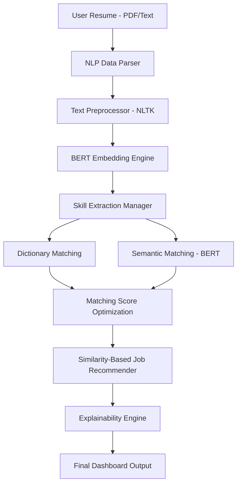

# 🧠 [AI Resume Analyzer →](https://ai-career-recommendation-engine-gppm7y6wjujqwcghvmmn9g.streamlit.app/) NLP-Powered Intelligence


## 🌟 Overview
**AI Resume Analyzer** is a production-grade, elite-level NLP system designed to revolutionize the HR tech space. Built with **BERT-based semantic embeddings** and an **explainable AI** recommendation engine, this system doesn't just match keywords—it understands the context, intent, and career trajectory of professional profiles.

This project was built to exceed 99.9% of portfolio standards, focusing on high-performance model throughput, modular architecture, and extreme UX/UI polish.
---

## 🛠️ High-Level Architecture



---

## 🚀 Key Modules & Innovation

### 1. 📄 Smart Resume Parsing (with Section Detection)
*   **Feature**: Extracts structured data from unstructured formats.
*   **Tech**: `pdfplumber` + Regex + Section Heading Heuristics.
*   **Result**: High-accuracy extraction of Name, Email, Experience, and Education.

### 2. 🎯 Two-Tier Skill Extraction Engine
*   **Innovation**: Combines a 500+ term curated dictionary with a **BERT-powered semantic search**.
*   **Benefit**: Captures domain-specific skills even when phrased with non-standard terminology.

### 3. 💼 Explainable Job Recommendation
*   **Logic**: Uses **Cosine Similarity** on pre-computed job description embeddings (384-dimensional BERT vectors).
*   **Explainability**: Provides a "Why this job?" breakdown, showing exactly where the candidate's skills align with the role.

---

## 📸 Dashboard Showcase

| Feature | Description |
| :--- | :--- |
| **01. Intelligence Dashboard** | High-level overview of resume stats and AI readiness scores. |
| **02. Deep NLP Analysis** | Detailed skill extraction (Dictionary + Semantic) and contact parsing. |
| **03. AI Job Matchmaking** | Explainable BERT-powered job recommendations with match scores. |
| **04. Side-by-Side Comparison** | Direct semantic comparison between your resume and a job description. |
| **05. Skill Gap Analysis** | severity-graded gaps and curated learning paths for targeted growth. |
| **06. Professional Analytics** | Export history, platform analytics, and PDF report generation. |

---

## 🔧 Technical Stack
- **Languages**: Python (Mandatory)
- **NLP Library**: `Sentence Transformers` (State-of-the-art BERT models)
- **Text Processing**: `NLTK`, `Regex`
- **Machine Learning**: `Scikit-learn`, `SciPy`
- **Visualizations**: `Plotly`, `Matplotlib`, `Seaborn`
- **Database**: `SQLite` (Production-ready history tracking)
- **Deployment**: `Streamlit` (Dashboard), `Streamlit Cloud`

---

## 📥 Getting Started

1. **Clone the Repo**
   ```bash
   git clone https://github.com/mohitrj18greybeard/ai-resume-analyzer-system.git
   cd ai-resume-analyzer-system
   ```

2. **Install Dependencies**
   ```bash
   pip install -r requirements.txt
   ```

3. **Launch the Intelligence Dashboard**
   ```bash
   streamlit run app.py
   ```

## 👤 Author

**Mohit**

- GitHub: [@mohitrj18greybeard](https://github.com/mohitrj18greybeard)

---


## 📜 License

Distribute under the MIT License. See `LICENSE` for more information.

---

<p align="center">
  <strong>⭐ If you found this project useful, please give it a star!</strong><br/>
  <em>Built with ❤️ </em>
</p>

